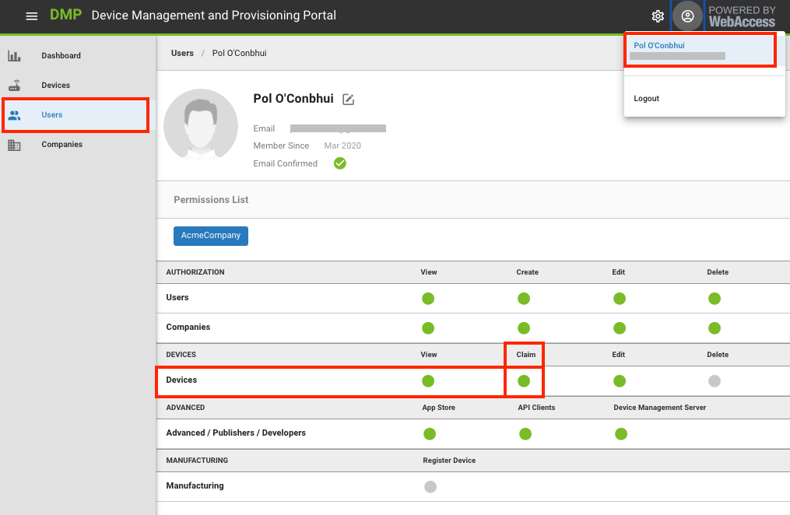
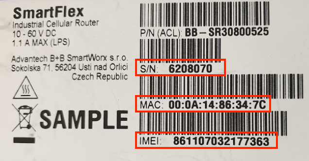
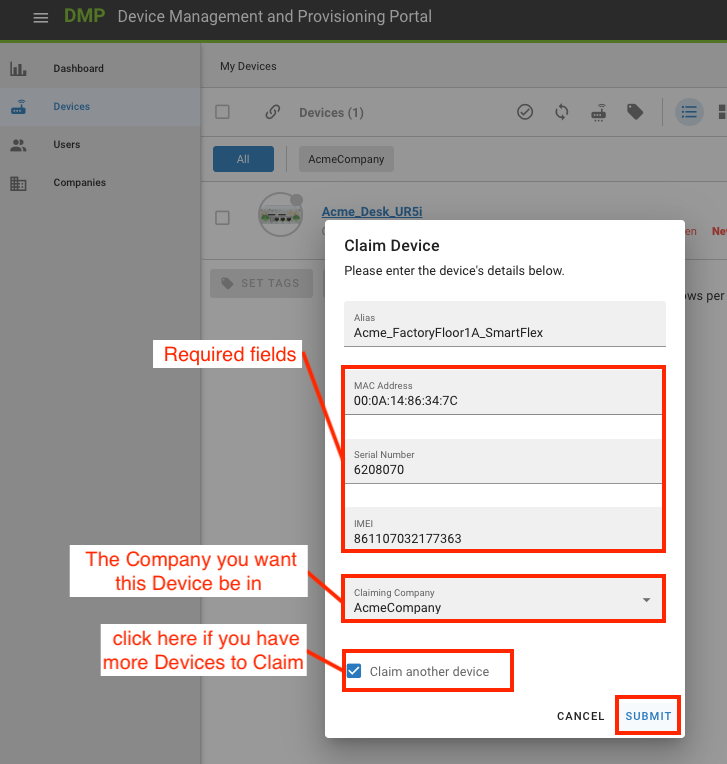

# Claim a Device to your Company

<iframe width="560" height="315" src="https://www.youtube.com/embed/cS1EdMOR430" frameborder="0" allow="accelerometer; autoplay; encrypted-media; gyroscope; picture-in-picture" allowfullscreen></iframe>

In order to Claim a Device to one of your Companies, you must have the authority to Claim a Device. 

Claiming a Device depends on 2 User criterion: 

User Authentication (successful login) is the first: User Authorisation (permissions) is the second. 

To check the user-permissions that you have, you may select your username from the Users list.

Your assigned permissions are shown as green dots.

e.g. 

**Rules**: 

Only un-claimed (aka "Released") Devices are available to be Claimed by a Company.

A Device may only be Claimed into one Company. 

A Device that has been Claimed into a Company, may be Released by that Company. 

A Device must be Claimed by a Company before it may be managed or monitored by that Company. 

**Steps**: 

Assuming you have the required permissions, you may Claim a Device to one of your Companies by following these steps: 

1. Select "Devices" from the Context menu. 

2. On the Actions bar, click on the "Claim Device" action button.

    

3. On the form that opens, there are 5 fields. 

   1. **Alias**

      Enter a human-friendly name here. 

      This is something that will help you to identify the physical device, by Alias name, later. 

      This is not a required field: you may leave this empty.  

   2. **MAC Address**

      Enter the exact MAC Address, for ETH0 of your Device, as it is printed on the label for the Device. 

      The MAC address format is 00:0A:14:aa:bb:cc

      You may enter the MAC address with or without the semi-colons.

      This is a required field: you must enter a valid MAC address for your Device here.

   3. **Serial Number**

      Enter the exact Serial Number for this Device, as it is printed on the label for the Device.

      Some Serial Numbers have alphanumeric characters: enter it as you see it. 

      This is a required field: you must enter a valid Serial Number for your Device here. 

   4. **IMEI**

      Enter the exact IMEI for this Device, as it is printed on the label for the Device.

      This is a required field: you must enter a valid IMEI for your Device.

      **Note**: Some Devices do _not_ have an IMEI number. For those Devices, you will not be required to enter an IMEI.

   5. **Claiming Company**

      This is the Company that you will put the Device into. 

      You may select any one of the Companies that you are authorised to Claim Devices for. 

4. If you have more than one Device to Claim, you may enable the "Claim another device" checkbox.

5. Submit.

Here's an example of a printed Device label: 

For this Device, the Claim Device form would look something like this:

 

After a Device has been successfully Claimed by a Company, it will appear in the Device List for that Company, like this: 

