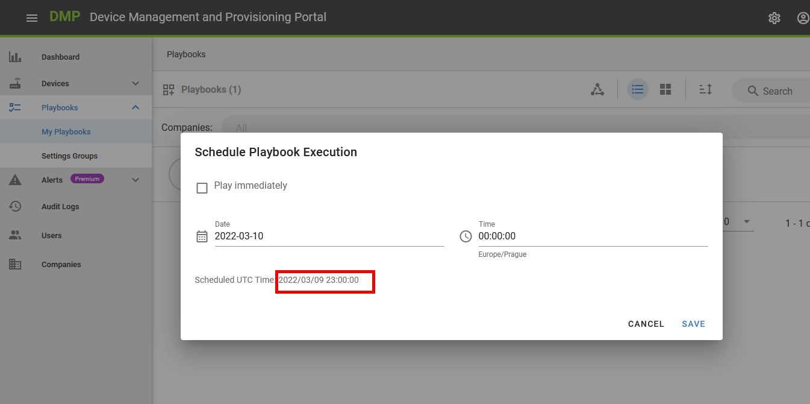
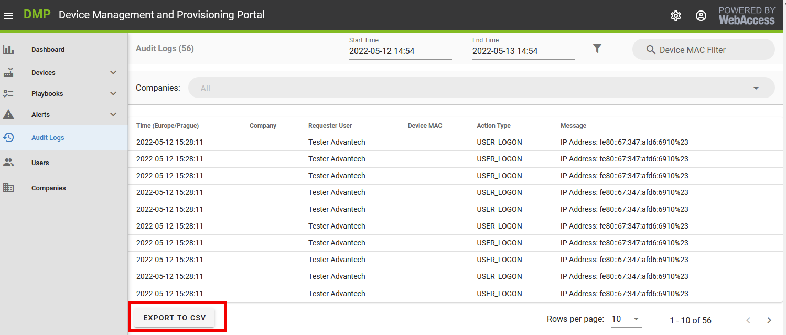
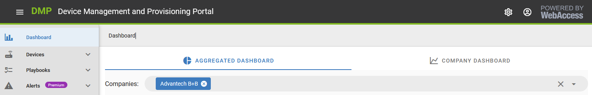
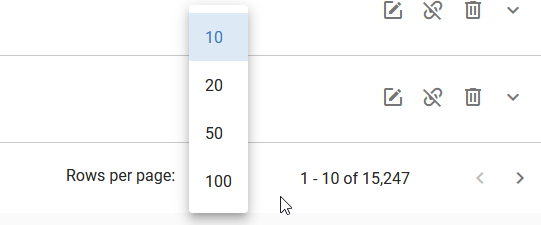
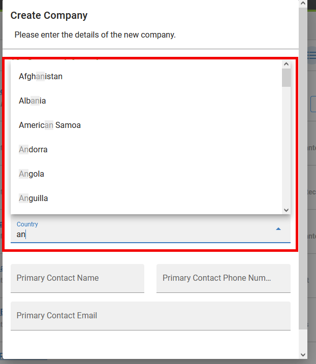
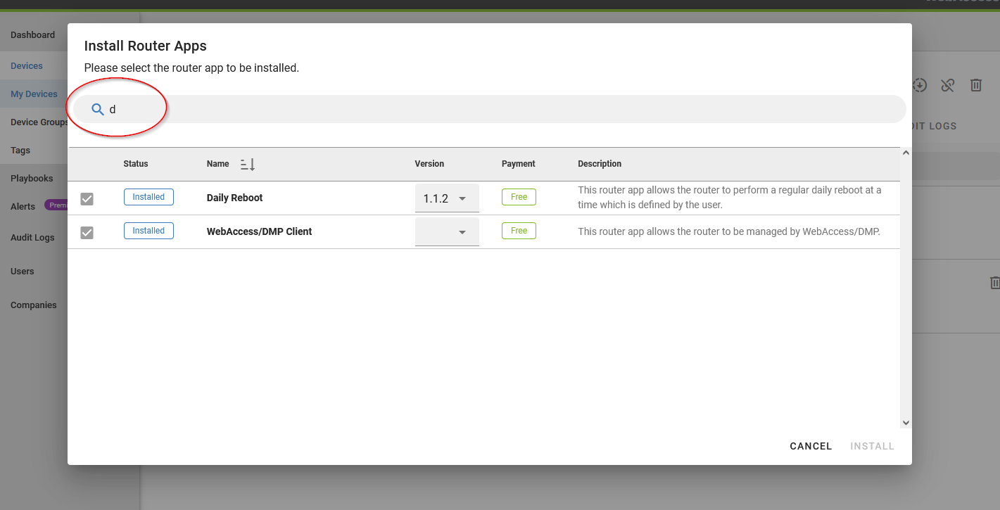
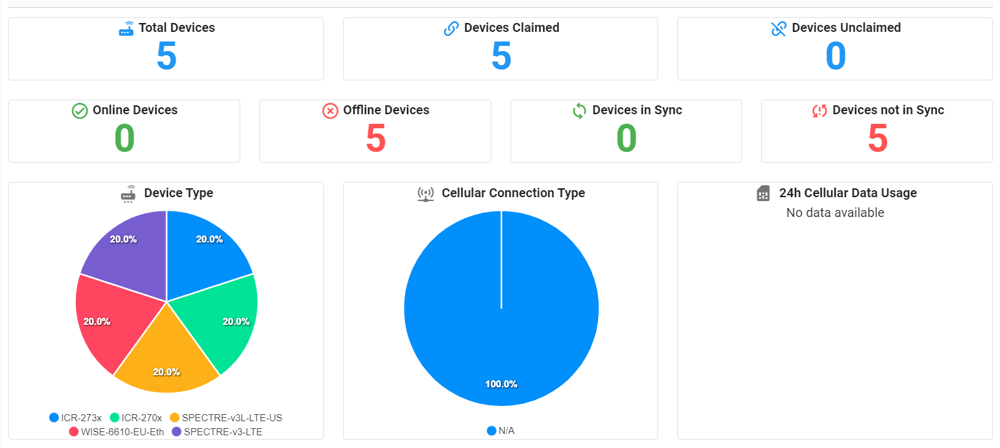
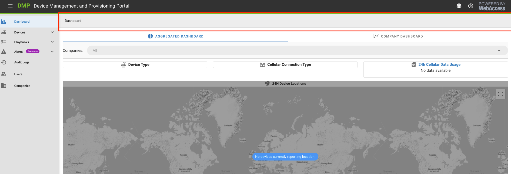
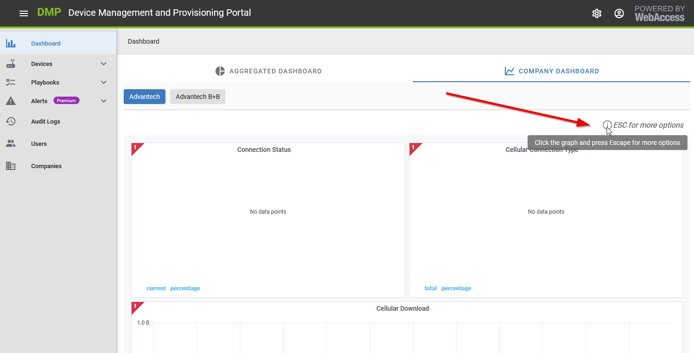

# 2.4.3: May 25th, 2022

* This release contains UI improvements, appearance changes, and bug fixes.

## Improvements:

* **Changed the date format to ISO standard YYYY-MM-DD across the UI.**

*  Added an option to export **Audit Logs** to the CSV file.

  

* For every user in **more than 10 companies, there will now be an autocomplete search bar** as a company filter instead of the old filter.
  

* **Company filter state will now be remembered** when navigating across the UI.

* **Pagination setting state will be remembered as well** when navigating across the UI.

* **Added alphabetical sorting and autocomplete feature to all forms with Company, Device Type, and Country fields** across the UI, so it's easier to select what you are looking for as you write down.

* **Improved the "Install Router Apps" section:**

    1. Router Apps are sorted alphabetically. The sort order can be changed.
    2. Added a search box to find a Router App quickly.
    3. Made bottom buttons still visible.
    4. Removed the checkbox to mark all apps.
    5. Widened the version field, so the whole version string of some Router Apps is visible.

* Changed the icon to a classic filter icon at Playbooks filter state and Audit Logs Action Type.

 

* Changed the position of the graph legend, which is now under the graphs on the Aggregated Dashboard.

 

* Changed text from MiBs to MBs everywhere in the GUI. We count 1 MB as 1024 kBs overall.

* Removed the Breadcrumb panels on top of the pages.

 

* Added the text "Press ESC for more options." to the Company dashboard, so graph settings can be found easier.

 

*  The **Premium label** at Alerts menu item now disappears once the user is in Premium companies.

## Bugfixes:

* Fixed multiple visual bugs and details: alignments, cropped company filter pills, unified bold text usage, added missing description tooltips. 

* Fixed visual bug of Invoice PDF that did not have any alignment borders.

* **Alerts:** Fixed an issue when changing the target type from single device to company was not saved even when falsely shown success. It can now be changed and saved.

* **Alerts:** Fixed devices offered for selection are now restricted to a company set up at rule for single device rule type.
  
 * **Auditing:** Fixed an issue where some events did not show because the minute accurate time filter wrongly did not include them. The time filter shows events in all 59 seconds of the selected minute.

* **Playbooks:** Fixed showing of Router Apps with is_aggreagate parameter set to true. These Routers Apps are now not offered to be installed but are automatically installed along with other Router App.
