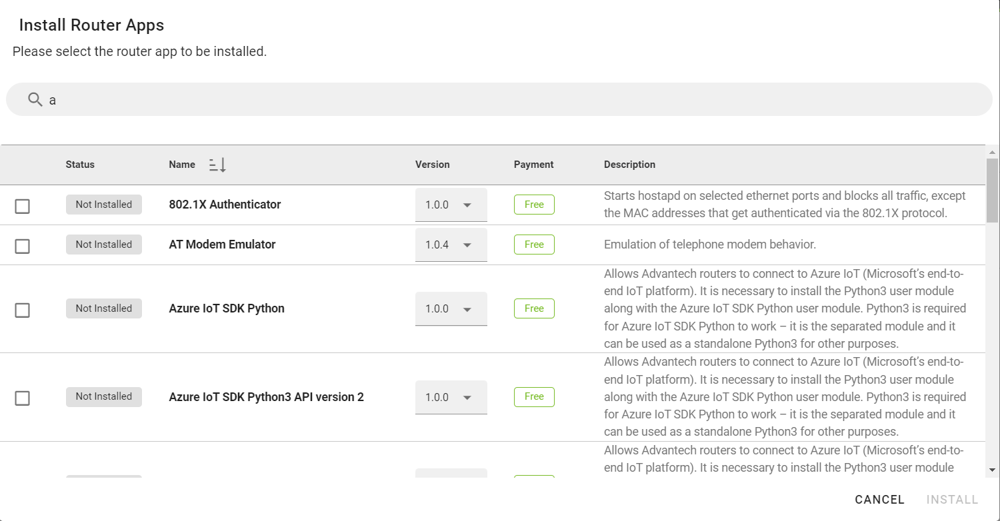

# 2.4.3: May 25th, 2022

* This release contains mainly bug fixes, UI appearance changes, and some new improvements.

## Improvements:

*  The **Premium label** now disappears once the account is upgraded to Premium.

*  Added an option to export **Auditing logs** to the CSV file in the whole 3 Auditing sections.

  

* **Pagination settings are now remembered when selected to 10, 20, 50 or 100. Affects all sections like Playbooks, Audit logs etc.**

* **Changed web UI date format to ISO standard (YYYY-MM-DD).**

* **Company filter will now remember Its state until the User's logout.**

* **Changes to the "Install Router Apps" section:**

    **1. Removed the button to mark all apps.**

    **2. Sorted Router Apps alphabetically.**

    **3. Added a search box in Router Apps.**

    **4. Cancel and Install buttons are now visible.**

* **When searching for Companies in all forms, It will now be sorted alphabetically and autocomplete as you write down.**

* **For everyone with more than 10 companies, there will be a search bar instead of the old filter.**

## UI:

* Fixed an issue where green dots in the **User's Permissions** section did not align correctly.

* Changed font from bold/regular text in DMP UI to the same way as on the My Device page section.

* Aligned the top icon to the others, menu icon aligned with menu icons.

 

* Added description tooltip for the inactive box.

 

* Added the same space to the aggregated dashboard.

* Changed the icon to a classic filter icon.

 

* Section on the picture aligned to the left.

 

* Changed the icon to the classic filter icon on all 3 places in the Auditing section.

 

* Changed the "Name" to the "Company Name".

 

* Added the text "Press ESC for more options." to the Company dashboard.

 

* Removed the link and tooltip text to the Grafana login page.

 

* Changed the position of legend, which is now under the graphs.

 

* Changed text from MiBs to MBs everywhere in the GUI.

 

* Removed panels on top of the pages.

 

* Widened Router Apps version field to show whole version string of Router Apps.

* Fixed format of Invoice Details PDF.

## Bugfixes:

* Only companies that are assigned to the User are now available.
* **Playbooks:** Applications are not displayed in the playbook app list if the "IsAggregate" parameter is set to true.
* Fixed an issue where an error message occurred and remained at the top of the form when creating a user with an already taken e-mail.
* **Auditing:** Fixed an issue where an event occurred sometimes, and the End Time hour filter won't show it.
* **Alerts:** Available devices are now shown, and the target types can be changed and saved.
* **Alerts:** Changing target type from single device to company can now be changed and saved.
* **SyncEngine:** Fixed error messages repeatedly reporting exceptions on Production MS Teams.

