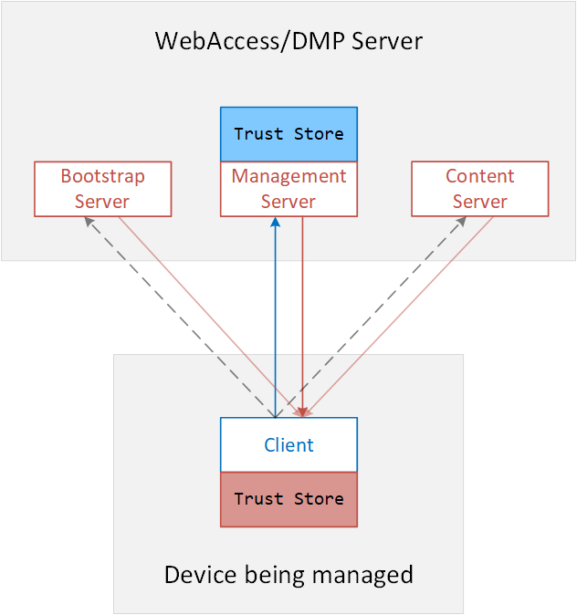
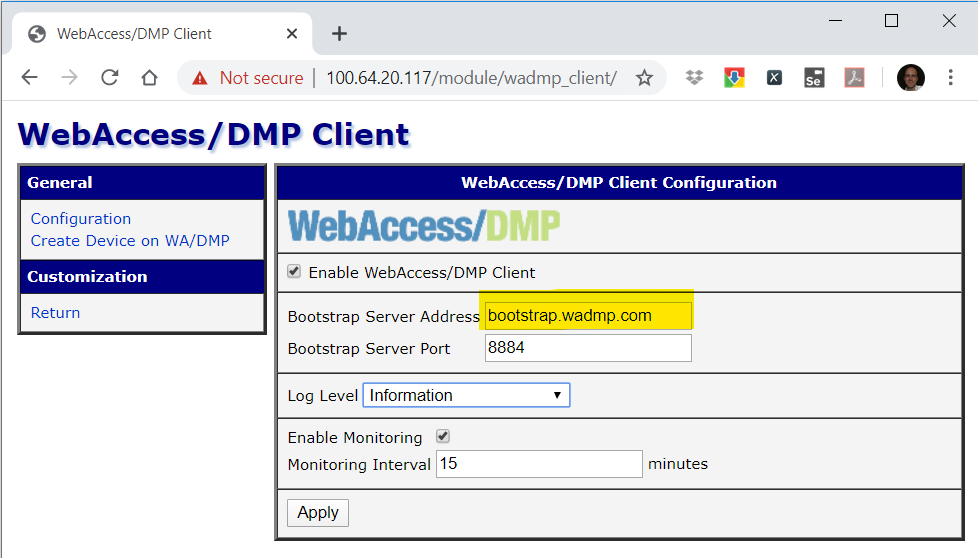
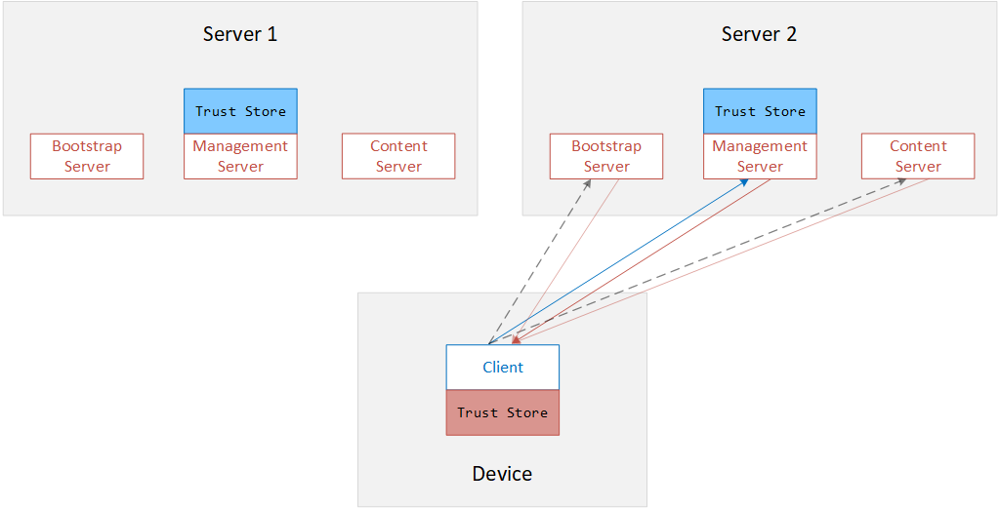
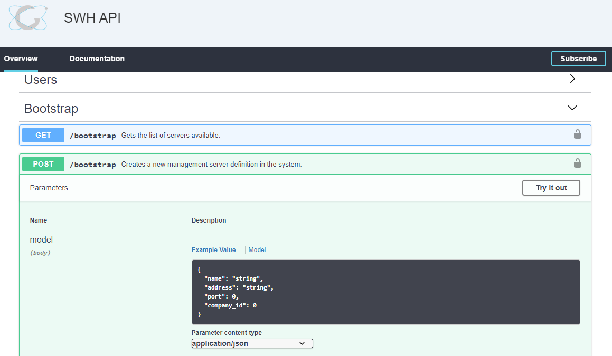
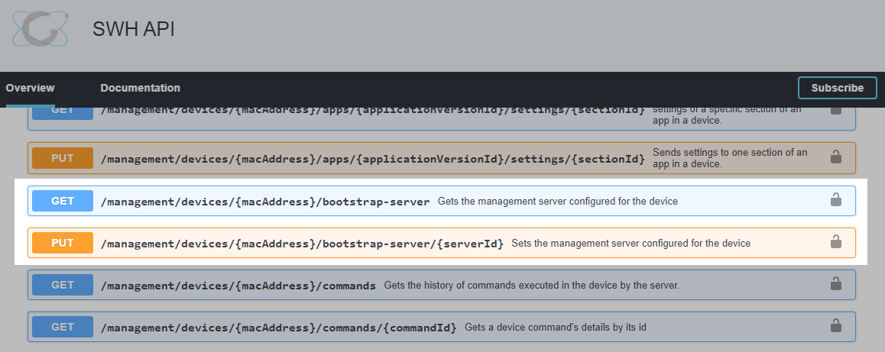
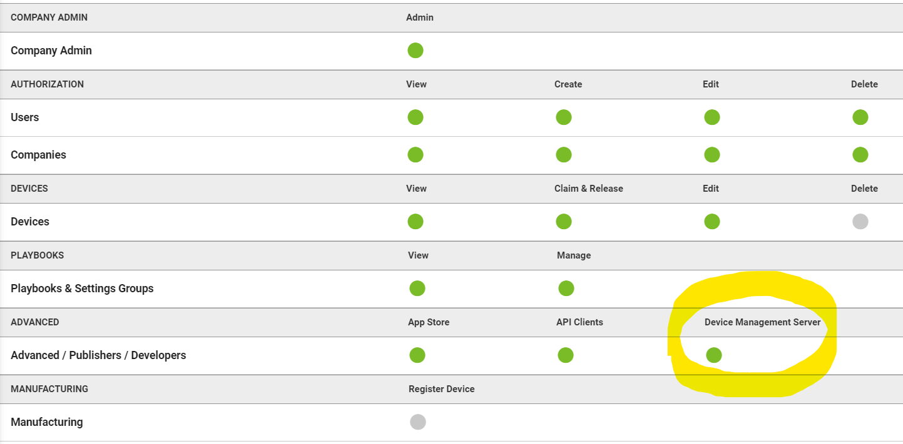
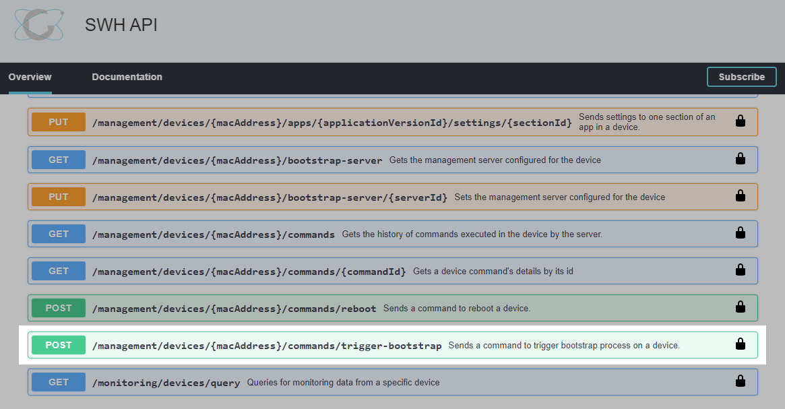

# How to move a device from one WebAccess/DMP Management Server to another

## Introduction

### Background

WebAccess/DMP follows the [LightWeightM2M](https://www.omaspecworks.org/what-is-oma-specworks/iot/lightweight-m2m-lwm2m/) protocol for "Client-Initiated Bootstrap", using "Certificate mode with Enrollment over Secure Transport" for maximum security.

You do not need to understand this protocol in order to follow this procedure, but it may provide some useful background information.

What you do need to understand is that a WebAccess/DMP server installation actually comprises several individual "servers":



The Bootstrap Server is used to direct the Client to one or more Management Servers.

During a bootstrap procedure, the Bootstrap Server provides two things to the client:
1. The address of the Management Server which will manage the device;
2. A security certificate which the client can use to identify itself to that Management Server.

The Management Server performs all of the actual device management tasks: firmware upgrade, device configuration, device monitoring, etc.

The Management Server may occasionally direct the Client to download a file from the Content Server, but for the purposes of this discussion the Content Server is irrelevant.

### Client configuration

When a client on a device is starting for the first time, the only information it has is the address of a Bootstrap Server.

The following image is a screenshot of the "WebAccess/DMP Client" Router Apps running on the local webserver of a router:


Note that there is no way to directly configure the client to point to a new Management Server.

In order to move a device to a new Management Server, you have two choices ...

### Option 1

Assuming you have access to the local webserver on the device, you can simply change the Bootstrap Server Address in the Router App configuration screen.



However, there are disadvantages to this approach:

* The configuration change can only be done manually;
* The device will forget everything about the original Bootstrap Server. If the initial connection to the new Bootstrap Server (on Server 2) fails, the device is lost;
* If the initial connection to the new Bootstrap Server (on Server 2) succeeds, but later Server 2 fails for some reason, it may not be possible to recover the device.

### Option 2

Maintain the connection between the device and the original Bootstrap Server, but re-configure the Bootstrap Server to direct the device to the new Management Server.


Advantages:

* The configuration change can be done via WebAccess/DMP itself, and can therefore be automated for multiple devices;
* If Server 2 fails for some reason, the device will always fall back to the original Bootstrap Server for new instructions;
* This approach allows for new use-cases and business models. For example, you can move a device to a new Management Server temporarily, safe in the knowledge that when the new server dies, the device can be recovered.

The rest of this article will explain the procedure for this approach (Option 2).

> Note:
  This procedure has been automated in a Jupyter Notebook that is available in our public GitHub repo:
  [github.com/wadmp/wadmp.github.io/blob/master/jupyter_notebooks/move_device.ipynb](https://github.com/wadmp/wadmp.github.io/blob/master/jupyter_notebooks/move_device.ipynb)

## General case

In the block diagrams above, we assume that the client on the device was originally configured to connect to the Bootstrap Server on Server 1.

Usually, the requirement is to move the device to a second server (Server 2), and possibly move it back again (to Server 1) at a later date.

But we also need to consider the most general case. Imagine the device has already been moved from Server 1 to Server 2. Can we move it from Server 2 to Server 3? And from there to Server 4?

The answer is yes. The key is that the device always remembers the URL of its original Bootstrap Server.

In the [Jupyter Notebook](https://github.com/wadmp/wadmp.github.io/blob/master/jupyter_notebooks/move_device.ipynb), you will see that the code handles the general case automatically. It refers to the original Bootstrap Server as "Server 0".

Usually, Server 0 *is* Server 1. So in order to avoid over-complicating things, for the remainder of this document we will make that assumption.

## Procedure

All of the following steps can be performed using the public REST API of both servers.

You can follow along manually by using the "OpenAPI" (Swagger) documentation page, for example [api.wadmp.com](https://api.wadmp.com).
You should have an equivalent page for the second server instance.

Alternatively, the whole procedure has been automated in a Jupyter Notebook that is available in our public GitHub repo: [github.com/wadmp/wadmp.github.io/blob/master/jupyter_notebooks/move_device.ipynb](https://github.com/wadmp/wadmp.github.io/blob/master/jupyter_notebooks/move_device.ipynb)

### Step 1: Tell the Bootstrap Server to which Management Server the device should be directed

By default, in any particular WebAccess/DMP server deployment, the Bootstrap Server is configured to direct all devices to the Management Server that is co-located with the Bootstrap Server.

In this step, you configure the Bootstrap Server on Server 1 to direct a device to a *different* Management Server: the Management Server on Server 2.

#### Step 1a

**_Using the Public API of Server 1 ..._**

In the Bootstrap section, send a POST request to "/bootstrap", to create a new Management Server definition:



* "name" is not important: it serves as a label or reminder for the user only.
* "address" is the IP address or DNS name of the Management Server.
* "port" is the TCP port number of the Management Server. (Usually 8883, which is the standard port number for MQTT over TLS.)
* "company_id" is your company ID in the system. (Can be obtained using the GET /companies endpoint if you don't know it already.)

#### Step 1b

**_Using the Public API of Server 1 ..._**

In the Devices section, send a PUT request to "/management/devices/{macAddress}/bootstrap-server/{serverId}", using the serverId obtained previously.



This means that the next time the devices performs a Bootstrap procedure, it will be directed to the new Management Server.

But we are not ready to re-direct it yet ...

### Step 2: Tell the new Management Server to trust the device's Bootstrap Server

The Management Server uses TLS with mutual authentication. i.e. The client must present a digital certificate. The *issuer* of this certificate must be trusted by the Management Server.

By default, the Bootstrap Server that is co-located with a Management Server is automatically trusted by that Management Server.

However, if your device has been directed to a *new* Management Server, then by default that Management Server will *not* allow the device to connect, because the client certificate presented was issued by an unknown Bootstrap Server.

You must update the "trust store" of the new Management Server with the certificates used by the device's Bootstrap Server. 

#### Step 2a

**_Using the Public API of Server 1 ..._**

In the Bootstrap section, use the "GET /certs" endpoint to check what certificates are in the trust store of the current Management Server. i.e. The Management Server on Server 1, where the device is currently connected.


> **Permissions**
> 
> In order to use the "GET /certs" endpoint, you must have the "Device Management Server" permission on Server 1.
> 
> In the WebAccess/DMP UI, you can view and modify the permissions of any user (on a per-company basis):
> 
> 
> 
> Alternatively, using the Public API you can view permissions using the "GET /users/{id}" endpoint and modify them using the "PUT /users/{id}/companies" endpoint.

The "GET /certs" request will return a JSON object like this:
```
{
   "data": {
      "certs": "LS0tLS1CRUdJTiBDRVJUSUZJQ0FURS0tLS0t...VElGSUNBVEUtLS0tLQo="
   },
   "success": true
}
```

"certs" is a Base64-encoded string. You can decode it using a web service like [www.base64decode.org/](https://www.base64decode.org/)

When decoded, you will see that it is a PEM file containing several X.509 certificates, usually three:
```
-----BEGIN CERTIFICATE-----
MIICzTCCAnOgAwIBAgIUHAGWV7GFmEummqHfcDEEr4HyM2MwCgYIKoZIzj0EAwIw
gbMxCzAJBgNVBAYTAklFMQ8wDQYDVQQIDAZHYWx3YXkxETAPBgNVBAcMCE9yYW5t
...
DyWJ466GETl5oF8b036sAiBty23FHKQLWSa7v6Cl13LNPOP66FRDt0jneNZHF7QE
wA==
-----END CERTIFICATE-----
-----BEGIN CERTIFICATE-----
MIICyDCCAm2gAwIBAgICEAEwCgYIKoZIzj0EAwIwgboxCzAJBgNVBAYTAklFMQ8w
DQYDVQQIDAZHYWx3YXkxIDAeBgNVBAoMF0FkdmFudGVjaCBCK0IgU21hcnRXb3J4
...
BAMCAYYwCgYIKoZIzj0EAwIDSQAwRgIhAMZNGdhH1KOm33dA8yibKUQK8uDtKoJJ
1zphLoEB3iOhAiEA9HOyt8t83eEGrdsL2Zdd9PaBaoK21MqU7vjA96L6xIM=
-----END CERTIFICATE-----
-----BEGIN CERTIFICATE-----
MIICxjCCAmugAwIBAgICEAAwCgYIKoZIzj0EAwIwgbMxCzAJBgNVBAYTAklFMQ8w
DQYDVQQIDAZHYWx3YXkxETAPBgNVBAcMCE9yYW5tb3JlMSAwHgYDVQQKDBdBZHZh
...
AgGGMAoGCCqGSM49BAMCA0kAMEYCIQDVUuB//bFW1T900osnQgElyQq8Qe3uPG0h
z6CnvTPHCAIhAKcu4nnZydZg1PTYwOZjZ54P5t+eIJKr3cL1Ts3J9Shb
-----END CERTIFICATE-----
```

> **Optional step**
> 
> If you are interested, you can split the file into individual certs and then use OpenSSL command-line tools to examine them:
> 
> `$ openssl x509 -in <cert> -text -noout`
> 
> You will see that the certificates are chained, and end in a self-signed root CA cert.
> This is the trust anchor for device authentication.


> **Background info.**
> 
> If you are *really* interested :), you should know that there is another way to check the Management Server's trust store, without using the API.
> 
> During the TLS (v1.2) handshake, the server sends a "Certificate Request" message to the client.
> This message actually includes the list of the client Certificate Authorities that are in the server’s trust store.
> 
> If you use the `openssl s_client` command to connect to the Management Server, the output will include "Acceptable client certificate CA names", already decoded for you:
> 
> `$ openssl s_client -connect management.wadmp.com:8883 -CAfile /opt/projects/pki/server/SCA0/certs/ca.cert.pem -tls1_2`
> 
> `CONNECTED(00000005)`
> 
> `depth=3 C = IE, ST = Galway, L = Oranmore, O = "Advantech B+B SmartWorx", OU = IoT, CN = Falcon Server Root CA (SCA0), emailAddress = bbcmsmanager@advantech.com`
> 
> `verify return:1`
> 
> `depth=2 C = IE, ST = Galway, O = "Advantech B+B SmartWorx", OU = IoT, CN = Falcon Server Intermediate Level-1 CA (SCA1_production), emailAddress = webaccessdmp@advantech.com`
> 
> `verify return:1`
> 
> `depth=1 C = IE, ST = Galway, O = "Advantech B+B SmartWorx", OU = IoT, CN = Falcon Server CA for Production (SCA2_production), emailAddress = webaccessdmp@advantech.com`
> 
> `verify return:1`
> 
> `depth=0 C = IE, ST = Galway, L = Oranmore, O = "Advantech B+B SmartWorx", OU = IoT, CN = "WADMP Management Server, Production Cloud", emailAddress = webaccessdmp@advantech.com`
> 
> `verify return:1`
> 
> `140025034838464:error:14094410:SSL routines:ssl3_read_bytes:sslv3 alert handshake failure:../ssl/record/rec_layer_s3.c:1528:SSL alert number 40`
> 
> `---`
> 
> `Certificate chain`
> 
> ` 0 s:C = IE, ST = Galway, L = Oranmore, O = "Advantech B+B SmartWorx", OU = IoT, CN = "WADMP Management Server, Production Cloud", emailAddress = webaccessdmp@advantech.com`
> 
> `   i:C = IE, ST = Galway, O = "Advantech B+B SmartWorx", OU = IoT, CN = Falcon Server CA for Production (SCA2_production), emailAddress = webaccessdmp@advantech.com`
> 
> ` 1 s:C = IE, ST = Galway, O = "Advantech B+B SmartWorx", OU = IoT, CN = Falcon Server CA for Production (SCA2_production), emailAddress = webaccessdmp@advantech.com`
> 
> `   i:C = IE, ST = Galway, O = "Advantech B+B SmartWorx", OU = IoT, CN = Falcon Server Intermediate Level-1 CA (SCA1_production), emailAddress = webaccessdmp@advantech.com`
> 
> ` 2 s:C = IE, ST = Galway, O = "Advantech B+B SmartWorx", OU = IoT, CN = Falcon Server Intermediate Level-1 CA (SCA1_production), emailAddress = webaccessdmp@advantech.com`
> 
> `   i:C = IE, ST = Galway, L = Oranmore, O = "Advantech B+B SmartWorx", OU = IoT, CN = Falcon Server Root CA (SCA0), emailAddress = bbcmsmanager@advantech.com`
> 
> `---`
> 
> `Server certificate`
> 
> `-----BEGIN CERTIFICATE-----`
> 
> `MIIDSTCCAvCgAwIBAgICEAEwCgYIKoZIzj0EAwIwgbUxCzAJBgNVBAYTAklFMQ8w`
> 
> `DQYDVQQIDAZHYWx3YXkxIDAeBgNVBAoMF0FkdmFudGVjaCBCK0IgU21hcnRXb3J4`
> 
> `MQwwCgYDVQQLDANJb1QxOjA4BgNVBAMMMUZhbGNvbiBTZXJ2ZXIgQ0EgZm9yIFBy`
> 
> `b2R1Y3Rpb24gKFNDQTJfcHJvZHVjdGlvbikxKTAnBgkqhkiG9w0BCQEWGndlYmFj`
> 
> `Y2Vzc2RtcEBhZHZhbnRlY2guY29tMB4XDTE5MTAwMzEzMjc1NloXDTIwMTAwMjEz`
> 
> `Mjc1NlowgcAxCzAJBgNVBAYTAklFMQ8wDQYDVQQIDAZHYWx3YXkxETAPBgNVBAcM`
> 
> `CE9yYW5tb3JlMSAwHgYDVQQKDBdBZHZhbnRlY2ggQitCIFNtYXJ0V29yeDEMMAoG`
> 
> `A1UECwwDSW9UMTIwMAYDVQQDDClXQURNUCBNYW5hZ2VtZW50IFNlcnZlciwgUHJv`
> 
> `ZHVjdGlvbiBDbG91ZDEpMCcGCSqGSIb3DQEJARYad2ViYWNjZXNzZG1wQGFkdmFu`
> 
> `dGVjaC5jb20wWTATBgcqhkjOPQIBBggqhkjOPQMBBwNCAASFexFsIrjfKwEufq1M`
> 
> `qgHlosaPLhAerIAtEb4lnwBMr22b+7WhnCIqlDCyTteRuXGZYuftNEaGQL/xQkKr`
> 
> `7/tRo4HiMIHfMAkGA1UdEwQCMAAwEQYJYIZIAYb4QgEBBAQDAgZAMDMGCWCGSAGG`
> 
> `+EIBDQQmFiRPcGVuU1NMIEdlbmVyYXRlZCBTZXJ2ZXIgQ2VydGlmaWNhdGUwHQYD`
> 
> `VR0OBBYEFGPi8TycsTD6SUrV3BwDkb5/XugjMB8GA1UdIwQYMBaAFCucwq3rviWz`
> 
> `QYQ2/+o0S3xrtqRZMA4GA1UdDwEB/wQEAwIFoDATBgNVHSUEDDAKBggrBgEFBQcD`
> 
> `ATAlBgNVHREEHjAcghRtYW5hZ2VtZW50LndhZG1wLmNvbYcEDU/2KTAKBggqhkjO`
> 
> `PQQDAgNHADBEAiA0M6lBmeiXfW9wmD/UOptPd+jeRAd+H4xutW3ZUBOwjAIgBKeD`
> 
> `ZD/bDFx1a1mT3+F977T5LQNWMUxxLLtJsQDtWDo=`
> 
> `-----END CERTIFICATE-----`
> 
> `subject=C = IE, ST = Galway, L = Oranmore, O = "Advantech B+B SmartWorx", OU = IoT, CN = "WADMP Management Server, Production Cloud", emailAddress = webaccessdmp@advantech.com`
> 
> `issuer=C = IE, ST = Galway, O = "Advantech B+B SmartWorx", OU = IoT, CN = Falcon Server CA for Production (SCA2_production), emailAddress = webaccessdmp@advantech.com`
> 
> `---`
> 
> **`Acceptable client certificate CA names`**
> 
> `C = IE, ST = Galway, O = "Advantech B+B SmartWorx", OU = IoT, CN = Falcon Device CA for Production (DCA2_production), emailAddress = webaccessdmp@advantech.com`
> 
> `C = IE, ST = Galway, O = "Advantech B+B SmartWorx", OU = IoT, CN = Falcon Device Intermediate Level-1 CA (DCA1_production), emailAddress = webaccessdmp@advantech.com`
> 
> `C = IE, ST = Galway, L = Oranmore, O = "Advantech B+B SmartWorx", OU = IoT, CN = Falcon Device Root CA (DCA0), emailAddress = bbcmsmanager@advantech.com`
> 
> `C = IE, ST = Galway, O = "Advantech B+B SmartWorx", OU = IoT, CN = Falcon Device CA for Development Environment (DCA2_develop), emailAddress = bbcmsmanager@advantech.com`
> 
> `C = IE, ST = Galway, O = "Advantech B+B SmartWorx", OU = IoT, CN = Falcon Test Device Intermediate Level-1 CA (DCA1_test), emailAddress = bbcmsmanager@advantech.com`
> 
> `C = IE, ST = Galway, L = Oranmore, O = "Advantech B+B SmartWorx", OU = IoT, CN = Falcon User CA (UCA_Advantech1), emailAddress = ben.kinsella@advantech.com`
> 
> `C = IE, ST = Galway, O = "Advantech B+B SmartWorx", OU = IoT, CN = WADMP Device CA for Staging, emailAddress = webaccessdmp@advantech.com`
> 
> `Client Certificate Types: RSA sign, DSA sign, ECDSA sign`
> 
> `Requested Signature Algorithms: ECDSA+SHA256:ECDSA+SHA384:ECDSA+SHA512:Ed25519:Ed448:RSA-PSS+SHA256:RSA-PSS+SHA384:RSA-PSS+SHA512:RSA-PSS+SHA256:RSA-PSS+SHA384:RSA-PSS+SHA512:RSA+SHA256:RSA+SHA384:RSA+SHA512:ECDSA+SHA224:ECDSA+SHA1:RSA+SHA224:RSA+SHA1:DSA+SHA224:DSA+SHA1:DSA+SHA256:DSA+SHA384:DSA+SHA512`
> 
> `Shared Requested Signature Algorithms: ECDSA+SHA256:ECDSA+SHA384:ECDSA+SHA512:Ed25519:Ed448:RSA-PSS+SHA256:RSA-PSS+SHA384:RSA-PSS+SHA512:RSA-PSS+SHA256:RSA-PSS+SHA384:RSA-PSS+SHA512:RSA+SHA256:RSA+SHA384:RSA+SHA512:ECDSA+SHA224:ECDSA+SHA1:RSA+SHA224:RSA+SHA1:DSA+SHA224:DSA+SHA1:DSA+SHA256:DSA+SHA384:DSA+SHA512`
> 
> `Peer signing digest: SHA256`
> 
> `Peer signature type: ECDSA`
> 
> `Server Temp Key: X25519, 253 bits`
> 
> `---`
> 
> `SSL handshake has read 3867 bytes and written 328 bytes`
> 
> `Verification: OK`
> 
> `---`
> 
> `New, TLSv1.2, Cipher is ECDHE-ECDSA-AES256-GCM-SHA384`
> 
> `Server public key is 256 bit`
> 
> `Secure Renegotiation IS supported`
> 
> `Compression: NONE`
> 
> `Expansion: NONE`
> 
> `No ALPN negotiated`
> 
> `SSL-Session:`
> 
> `    Protocol  : TLSv1.2`
> 
> `    Cipher    : ECDHE-ECDSA-AES256-GCM-SHA384`
> 
> `    Session-ID: `
> 
> `    Session-ID-ctx: `
> 
> `    Master-Key: C92E036601E64921EA5F20D39A0A9FF53A3B6BDB709DD2819A4AF7A968D1E6F0AF7961593E0792139B7B15EEC5340E78`
> 
> `    PSK identity: None`
> 
> `    PSK identity hint: None`
> 
> `    SRP username: None`
> 
> `    Start Time: 1590769106`
> 
> `    Timeout   : 7200 (sec)`
> 
> `    Verify return code: 0 (ok)`
> 
> `    Extended master secret: yes`
> 
> `---`


#### Step 2b

**_Using the Public API of Server 2 ..._**

Use the same "GET /certs" endpoint on Server 2 to check what certificates are in the trust store of the *new* Management Server.

Decode the "certs" string as before.

#### Step 2c

Any certificate in Server 1 that is NOT already in Server 2 must be added to Server 2.

Copy and paste the concatenated certificates into a web service like [www.base64encode.org/](https://www.base64encode.org/). The order of the certificates doesn't matter.

**_Using the Public API of Server 2 ..._**

In the Bootstrap section, use the "PUT /certs" endpoint to upload the new Base64-encoded string as "certs".

i.e. Pass the following JSON object in the body:
```
{
   "certs": "<new Base64-encoded string including new certs>"
}
```


> **Permissions**
> 
> In order to use the "PUT /certs" endpoint, you must be a SysAdmin on Server 2.
> 
> * If your Server 2 instance is an On-Premises installation of WebAccess/DMP, then there will be a SysAdmin user within your organisation.
> 
> * If your Server 2 instance is the public cloud installation of WebAccess/DMP (www.wadmp.com), then only the Advantech SysAdmin has permission to perform this step.

> **Optional step**
> 
> If you used the `openssl s_client` command earlier, you can run it again now and you should find the new client CA(s) listed under "Acceptable client certificate CA names".

### Step 3: Trigger a new Bootstrap procedure

**_Using the Public API of Server 1 ..._**

In the Devices section, use the "POST /management/devices/{macAddress}/commands/trigger-bootstrap" endpoint to command the device to initiate a new bootstrap process:



The device will receive a new certificate from the Bootstrap Server, and it will also receive the address of the new Management Server (on Server 2).

It will attempt to connect to Server 2 immediately.

The connection will be successful if:

1. The X.509 certificates were copied to Server 2 as described in this procedure;

2. The device identity exists in Server 2. i.e. Use the "Create Device" screen in the WebAccess/DMP UI, or the "POST /identity/devices" endpoint in the API.