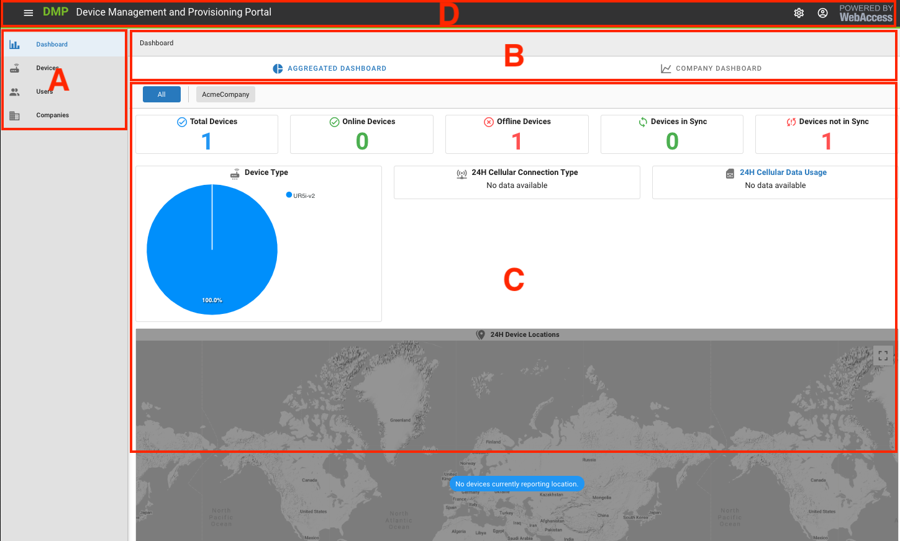

# General Structure of the User Interface

The UI is structured into 4 main areas. 

<u>A: The Context Panel</u>

The Context Panel is where the current context for panels B and C is selected.

<u>B: The Actions Panel</u>

This is where the available Actions will appear. 

What you see here depends on the selected Context.

<u>C: The Details Panel</u>

This is the main panel of information. The details presented here depend on the Context and Actions that have been selected. 

<u>D: The Title Panel</u>

The Title Panel contains some information about the current running software version, it has links to user documentation, and has logged-in user information.
